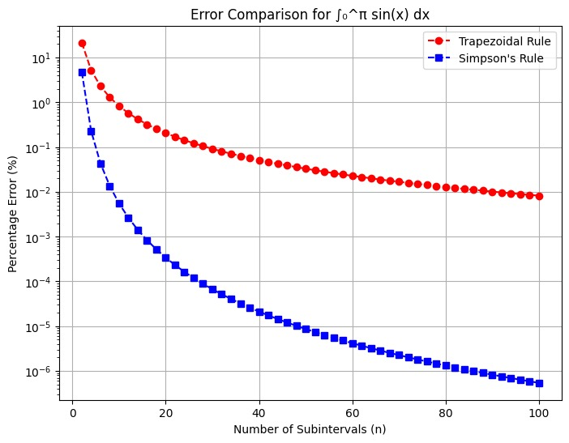
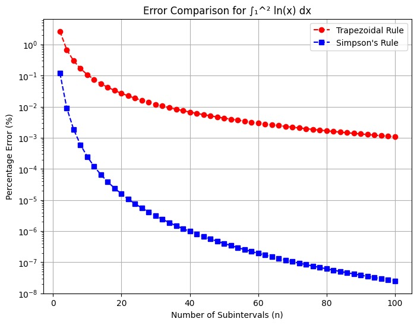

# Numerical Assignment:Implement Simpson’s Rule. Compare its accuracy with the Trapezoidal Rule on at least two integrals (e.g., Integral of `sin(x)` from 0 to π  
   \[
   \int_{0}^{\pi} \sin(x) \, dx
   \]

 Integral of `ln(x)` from 1 to 2  
   \[
   \int_{1}^{2} \ln(x) \, dx
   \]
)


## (I) Introduction
Numerical integration is widely used when analytical evaluation of an integral is difficult or impossible.  
Two popular methods are:
- **Trapezoidal Rule**: Approximates the curve with trapezoids.
- **Simpson’s Rule**: Uses parabolic arcs for approximation (more accurate).

This project compares both methods on two integrals:
1. ∫₀^π sin(x) dx  
2. ∫₁² ln(x) dx  

---

## (II) Project Details
- **Course**: CSE261 Group Assignment  
- **Topic**: Implementation and Comparison of Simpson's and Trapezoidal Rules  
- **Language**: C  

---
## (III) C Code
```c

#include <stdio.h>
#include <math.h>

// Function Prototypes
double trapezoidal_rule(double(*f)(double),double a,double b,int n);
double simpsons_rule(double(*f)(double),double a,double b,int n);

// Functions to integrate
double f1(double x) { return sin(x); }   // f1 = sin(x)
double f2(double x) { return log(x); }   // f2 = ln(x)

int main() {
    int n;
    double a1 = 0.0, b1 = M_PI;   // sin(x) from 0 to π
    double a2 = 1.0, b2 = 2.0;    // ln(x) from 1 to 2
    double exact1 = 2.0;          // ∫0 to π sin(x) dx
    double exact2 = 2 * log(2) - 1;   // ∫1 to 2 ln(x) dx

    printf("Enter numbers of intervals (n): ");
    scanf("%d", &n);

    if (n % 2 != 0) {
        printf("Simpson's Rule requires even n, so using n+1.\n");
        n++;
    }

    double trap1 = trapezoidal_rule(f1,a1,b1,n);
    double simp1 = simpsons_rule(f1,a1,b1,n);
    double trap2 = trapezoidal_rule(f2,a2,b2,n);
    double simp2 = simpsons_rule(f2,a2,b2,n);

    double error_trap1 = fabs(trap1 - exact1) / exact1 * 100.0;
    double error_simp1 = fabs(simp1 - exact1) / exact1 * 100.0;
    double error_trap2 = fabs(trap2 - exact2) / exact2 * 100.0;
    double error_simp2 = fabs(simp2 - exact2) / exact2 * 100.0;

    printf("\n--- Numerical Integration Results ---\n");
    printf("\n1) Integral of sin(x) from 0 to π:\n");
    printf("   • Trapezoidal Rule Result = %.8lf | Error %% = %.6lf%%\n", trap1, error_trap1);
    printf("   • Simpson's Rule Result  = %.8lf | Error %% = %.6lf%%\n", simp1, error_simp1);

    printf("\n2) Integral of ln(x) from 1 to 2:\n");
    printf("   • Trapezoidal Rule Result = %.8lf | Error %% = %.6lf%%\n", trap2, error_trap2);
    printf("   • Simpson's Rule Result  = %.8lf | Error %% = %.6lf%%\n", simp2, error_simp2);

    return 0;
}

double trapezoidal_rule(double (*f)(double), double a, double b, int n) {
    double h = (b - a) / n;
    double sum = f(a) + f(b);
    for (int i = 1; i < n; i++) {
        sum += 2 * f(a + i * h);
    }
    return (h / 2.0) * sum;
}

double simpsons_rule(double (*f)(double), double a, double b, int n) {
    double h = (b - a) / n;
    double sum = f(a) + f(b);
    for (int i = 1; i < n; i++) {
        if (i % 2 == 0)
            sum += 2 * f(a + i * h);
        else
            sum += 4 * f(a + i * h);
    }
    return (h / 3.0) * sum;
}
--- Sample output n=10 ---

1) Integral of sin(x) from 0 to π:
   Trapezoidal = 1.98352354 | Error = 0.823823%
   Simpson's   = 2.00010952 | Error = 0.005476%

2) Integral of ln(x) from 1 to 2:
   Trapezoidal = 0.38631871 | Error = 0.004044%
   Simpson's   = 0.38629441 | Error = 0.000000%

---
```



## (IV) Conclusion

- Simpson’s Rule is generally more accurate than Trapezoidal Rule for smooth functions.
- Trapezoidal Rule gives a reasonable approximation but with higher error.
- Increasing the number of intervals improves accuracy, with Simpson’s Rule converging faster.
- This project demonstrates the practical advantage of Simpson’s Rule in numerical integration.
